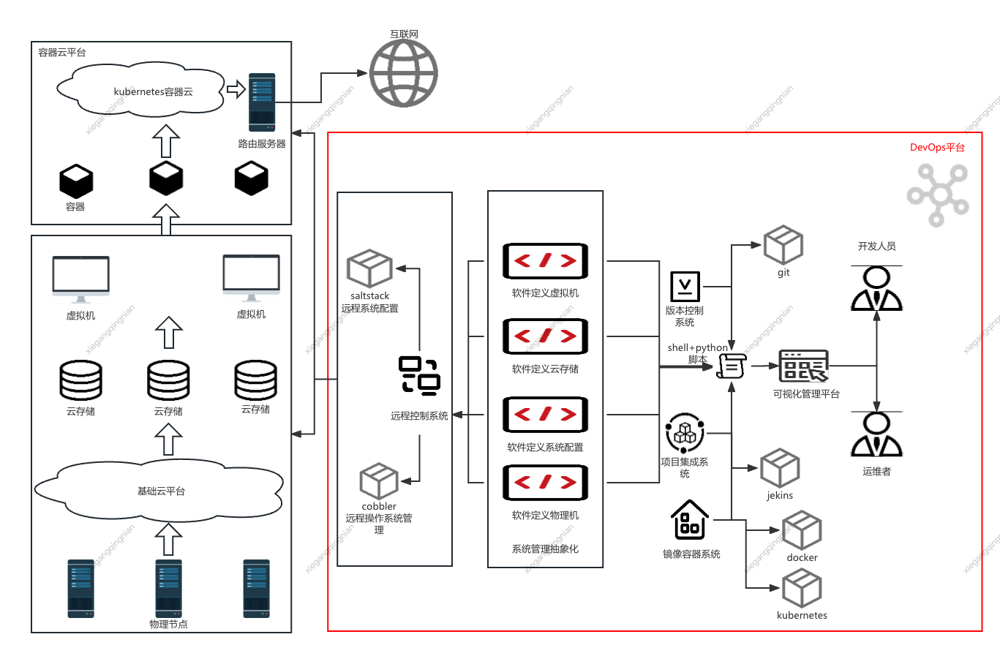
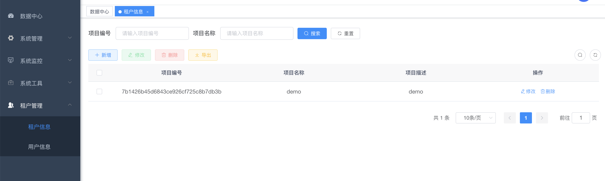

# 手撕云计算运维开发

## 1.目录结构

`fronted/` 前端 基于 `vue`

`backend/` 后端 基于 `SpringBoot`

`cmd/` 运维脚本 基于 `Linux Shell`

## 2.准备环境

### 2.1云计算平台搭建

本系统采用RedHatOpenStackPlatform搭建私有云

以单节点为例，节点IP为`192.168.105.10`，使用vmware创建一台`CentOS7.5`虚拟机，配置为4核CPU/8G/100G，主机名为controller

搭建步骤如下
- 关闭相关服务

所有节点填写网络映射
```shell
$ echo "192.168.105.10 controller" >> /etc/hosts
```
所有节点永久关闭 selinux，永久关闭 firewalld，永久关闭 NetworkManager
```shell
$ systemctl stop firewalld; systemctl disable firewalld
$ systemctl stop NetworkManager; systemctl disable NetworkManager
$ sed -i 's#SELINUX=.*#SELINUX=disabled#g' /etc/selinux/config
$ reboot
```
- 配置yum

清空yum源

```shell
$ mv /etc/yum.repos.d/* /tmp/
```
在controller节点挂载本地源
```shell
$ mkdir -p /opt/{centos,extras,openstack}

$ mount -o loop /root/CentOS-7-x86_64-Everything-1804.iso /mnt/
$ cp -rvf /mnt/* /opt/centos/
$ umount /mnt/

$ mount -o loop /root/RHEL7-extras.iso /mnt/
$ cp -rvf /mnt/* /opt/extras/
$ umount /mnt/

$ mount -o loop /root/RHEL7OSP-10.iso /mnt/
$ cp -rvf /mnt/* /opt/openstack/
$ umount /mnt/
```
在controller节点编写本地源
```shell
$ vi /etc/yum.repos.d/local.repo
[centos]
name=centos
baseurl=file:///opt/centos/
gpgcheck=0
enabled=1

[extras]
name=extras
baseurl=file:///opt/extras/
gpgcheck=0
enabled=1

[openstack]
name=openstack-10
baseurl=file:///opt/openstack/rhel-7-server-openstack-10-rpms/
gpgcheck=0
enabled=1

[openstack-devtool]
name=openstack-10-devtools
baseurl=file:///opt/openstack/rhel-7-server-openstack-10-devtools-rpms/
gpgcheck=0
enabled=1
```
- 需要安装的依赖包

qemu-kvm -> 硬件仿真 -> compute节点

libvirt-daemon -> 后台管理进程，管理硬件仿真 -> compute节点

libvirt-daemon-driver-qemu -> 驱动程序 -> compute节点

libvirt-client -> 后台管理的接口 -> compute节点

python-setuptools -> Python -> controller节点

节点安装依赖

```shell
$ yum -y install qemu-kvm libvirt-client libvirt-daemon libvirt-daemon-driver-qemu python-setuptool
```

- 检查基础环境

是否禁用 firewalld 和 NetworkManager

是否为静态 IP

主机之间是否能 ping 通

依赖包是否是10670

依赖是否安装

```shell
$ systemctl start libvirtd
```

NTP是否可用，时间是否同步

检查 /etc/resolv.conf 不能有search开头的行
- 安装OpenStack需要使用的 PackStack

在 controller节点 安装

```shell
$ cd /root/
#安装PackStack
$ yum -y install openstack-packstack
#使用PackStack创建应答文件
$ packstack --gen-answer-file=answer.ini
```

- 修改应答文件

```shell
$ sed -i "s#^CONFIG_SWIFT_INSTALL=.*#CONFIG_SWIFT_INSTALL=n#g" answer.ini
$ sed -i "s#^CON:FIG_CEILOMETER_INSTALL=.*#CONFIG_CEILOMETER_INSTALL=n#g" answer.ini
$ sed -i "s#^CONFIG_AODH_INSTALL=.*#CONFIG_AODH_INSTALL=n#g" answer.ini
$ sed -i "s#^CONFIG_GNOCCHI_INSTALL=.*#CONFIG_GNOCCHI_INSTALL=n#g" answer.ini
$ sed -i "s#^CONFIG_NTP_SERVERS=.*#CONFIG_NTP_SERVERS=time1.aliyun.com#g" answer.ini
$ sed -i "s#^CONFIG_COMPUTE_HOSTS=.*#CONFIG_COMPUTE_HOSTS=192.168.105.10#g" answer.ini
$ sed -i "s#^CONFIG_NETWORK_HOSTS=.*#CONFIG_NETWORK_HOSTS=192.168.105.10#g" answer.ini
$ sed -i "s#^CONFIG_KEYSTONE_ADMIN_PW=.*#CONFIG_KEYSTONE_ADMIN_PW=123456#g" answer.ini
$ sed -i "s#^CONFIG_NEUTRON_ML2_TYPE_DRIVERS=.*#CONFIG_NEUTRON_ML2_TYPE_DRIVERS=flat,vxlan#g" answer.ini
$ sed -i "s#^CONFIG_NEUTRON_OVS_BRIDGE_MAPPINGS=.*#CONFIG_NEUTRON_OVS_BRIDGE_MAPPINGS=physnet1:br-ex#g" answer.ini
$ sed -i "s#^CONFIG_NEUTRON_OVS_BRIDGE_IFACES=.*#CONFIG_NEUTRON_OVS_BRIDGE_IFACES=br-ex:ens33#g" answer.ini
$ sed -i "s#^CONFIG_PROVISION_DEMO=.*#CONFIG_PROVISION_DEMO=n#g" answer.ini
```

- 安装

```shell
$ packstack --answer-file=answer.ini
```

- 验证安装是否成功

配置Dashboard

```
$ vi /etc/httpd/conf.d/15-horizon_vhost.conf
#在 WSGIProcessGroup apache 下面 插入一行
WSGIApplicationGroup %{GLOBAL}

$ systemctl reload httpd
```


验证登录 OpenStack dashboard

http://192.168.105.10/dashboard

用户名：admin

密码：123456

### 2.2 运维平台运行环境

节点IP为`192.168.105.20`，使用vmware创建一台`CentOS7.5`虚拟机，配置为2核CPU/2G/40G，主机名为devops

- 安装docker

```shell
# 配置docker仓库
$ curl -o /etc/yum.repos.d/docker-ce.repo https://mirrors.aliyun.com/docker-ce/linux/centos/docker-ce.repo

# 修改CentOS基础仓库为aliyun
$ curl -o /etc/yum.repos.d/CentOS-Base.repo https://mirrors.aliyun.com/repo/Centos-7.repo
$ sed -i -e '/mirrors.cloud.aliyuncs.com/d' -e '/mirrors.aliyuncs.com/d' /etc/yum.repos.d/CentOS-Base.repo
$ yum makecache

# 关闭防火墙
$ systemctl stop network
$ systemctl disable network

# 禁用selinux
$ sed -i 's#^SELINUX=.*#SELINUX=disabled#g' /etc/selinux/config
$ reboot

# 安装docker
$ yum -y install docker-ce
$ systemctl start docker
$ systemctl enable docker
```

- 运行MySQL

```shell
# 运行容器
$ docker run --name mysql -p 3306:3306 -d -e MYSQL_ROOT_PASSWORD=123456 -e TZ=Asia/Shanghai -v /opt/data/mysql:/var/lib/mysql mysql:8.0 --lower_case_table_names=1
```

- 运行Redis

```shell
$ docker run --name redis -p 6379:6379 -d -e TZ=Asia/Shanghai redis
```

- 安装Java

```shell
$ yum -y install java-1.8.0-openjdk
```

### 2.3 准备开发环境

本人使用Macbook，以Macbook描述开发环境准备步骤

- 安装`jdk1.8`
- 安装`nvm` 注：`nvm`是`nodejs`框架的管理器

```sh
# 安装nvm
$ brew install nvm

# 添加环境变量
$ vi ~/.zshrc 
export NVM_DIR="$HOME/.nvm"
# 路径可能需要根据您实际的Homebrew安装位置进行调整
[ -s "/opt/homebrew/opt/nvm/nvm.sh" ] && \. "/opt/homebrew/opt/nvm/nvm.sh"
[ -s "/opt/homebrew/opt/nvm/etc/bash_completion.d/nvm" ] && \. "/opt/homebrew/opt/nvm/etc/bash_completion.d/nvm"

# 生效
$ source ~/.zshrc

# 测试
$ nvm --versio
```

- 使用`nvm`安装nodejs v14.18.2 版本

```shell
$ nvm install v14.18.2
```

- 配置免密登录openstack节点

```sh
# 生存公钥与私钥，如果有可以跳过
$ ssh-keygen -t rsa -C "your_email@example.com" # 之后一直回车

# 将公钥复制给OpenStack节点
$ cat ~/.ssh/rsa.pub #将其中的公钥进行复制
ssh-rsa AAAAB3N*****

# 登录OpenStack节点，将复制的公钥拷贝到OpenStack节点
$ ssh root@192.168.105.10
$ echo "ssh-rsa AAAAB3N*****" >> ~/.ssh/authorized_keys #将复制的公钥添加进来
$ exit

# 测试免密登录
$ ssh root@192.168.105.10
```

<font color='red'>需要免密的原因：后面会在SpringBoot接口内部驱动ssh 访问OpenStack，并执行OpenStack中的运维脚本 </font>

- 用idea导入`backend/`
- 用webstorm导入`frontend/`
- 将 `cmd/`目录 拷贝到OpenStack节点的根目录

```sh
$ scp -r cmd/ root@192.168.105.10:/
# cmd目录中包含的是编写的运维OpenStack的自定义脚本
```

- 用navicat链接mysql，地址 192.168.105.20:3306，并导入提供的devops.sql，请使用日期最新的进行导入

- 在idea中启动后端项目

```yaml
# 修改application.yml
# 路径：neu-admin/src/main/resources/application.yml
carbon:
  profile: /Users/username/Desktop/project/devops/var/uploadPath # 修改路径为自己设定的路径
  execHost: 192.168.105.10 # 发起Linux命令的目标主机，这里设定为OpenStack主机地址
  execPort: 22 # 发起Linux命令的目标主机的端口，这里设定为OpenStack主机远程访问端口
  execUser: root # 发起Linux命令的目标主机的用户，这里设定为OpenStack主机远程访问用户
server:
  tomcat:
    # 改为自己设定的路径
    basedir: /Users/chengda/Desktop/project/devops/var/temp
    # 连接超时改为10分钟
    connection-timeout: 600000
    # 原因：执行OpenStack脚本后，数据结果要回填项目数据库，这需要一定的响应时间，目前没做异步处理
spring:
  redis:
    # 地址与端口，
    host: 192.168.105.20
    port: 6379

# 修改 application-druid.yml
# 路径：neu-admin/src/main/resources/application-druid.yml
spring:
    datasource:
      druid:
    # 主库数据源
        master:
            # 数据库链接
          url: jdbc:mysql://192.168.105.20:3306/devops?useUnicode=true&characterEncoding=utf8&zeroDateTimeBehavior=convertToNull&useSSL=true&serverTimezone=GMT%2B8
          username: root
          password: 123456
```

```xml
<!-- 修改logback.xml -->
<!-- 路径：neu-admin/src/main/resources/logback.xml -->
<?xml version="1.0" encoding="UTF-8"?>
<configuration>
  <!-- 日志存放路径，改为自己设定的路径 -->
	<property name="log.path" value="/Users/username/Desktop/project/devops/var/logs" />
```

启动项目

- 在webstorm中，打开终端，切换到nodejs v14.18.2，启动项目

```sh
# 将当前使用的nodejs 切换为 v14.18.2
$ nvm use v14.18.2

# 安装依赖
$ npm i

# 运行
npm run dev
```

系统整体架构如下


效果如下



<font color='red'>注意：后面后台代码变更均在neu-system包中，前台代码变更均在 frontend/src/views/system 路径下 </font>

# 3. 迭代记录

- 2024-10-25 完成租户新增，租户删除
- 2024-10-27 完成用户新增，用户删除
- 2024-11-01 完成用户与租户的角色关联
  - 数据库表`openstack_project_user`
  - 脚本`openstack-project-user-associate.sh`
- 2024-11-05 完成用户与租户的角色关联
  - 前端 
  - 后端
  - 创建数据库脚本 devops-2024-11-05.sql
- 2024-11-07 新增租户用户的关联解除-完毕
  - 脚本 `openstack-project-user-disassociate.sh`
  - 后端接口 `OpenstackProjectUserController.sh` 增加解除关联逻辑

- 2024-11-12 新增镜像管理-新增镜像-脚本-数据库-低代码-接口
  - 脚本 `openstack-image-create.sh`
  - 后端接口 `OpenstackImageInfoController.java`
  - 前端页面-低代码初始化页面
    - `openstack_image_info.js`
    - `openstack_image_info/index.vue`
  - 数据库更新 `devops-2024-11-12.sql`
